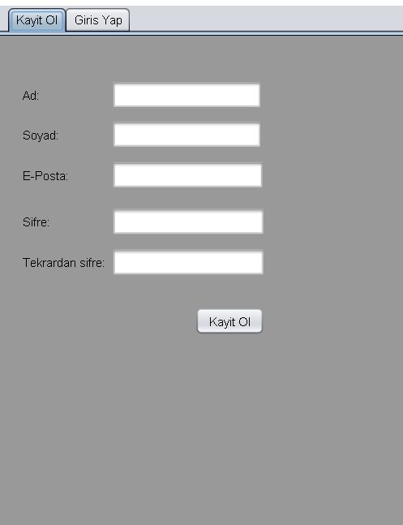
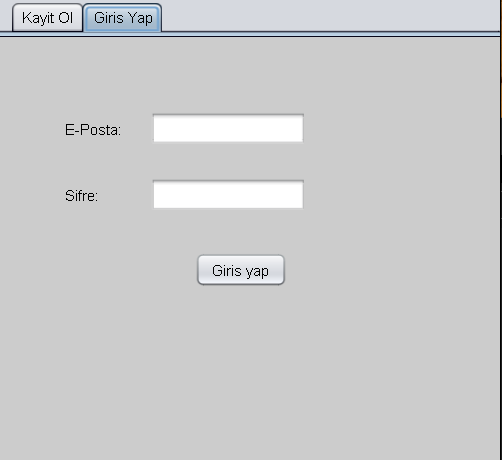
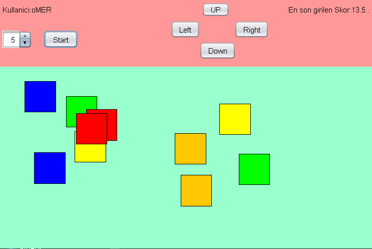

# Renk Eslestirme Oyunu (Color Matching Game)

A Java Swing desktop game with a user registration and login system. Players match colored boxes by moving them on top of each other as fast as possible. The score is calculated based on completion time and the number of box pairs selected.

---

## Screenshots

### 1. Register Screen



---

### 2. Login Screen



---

### 3. Main Game Screen



---

## Project Structure

```
projebp2/
│
├── User.java          # User registration and login screen
├── AnaSayfa.java      # Main game screen and game logic
├── ColorBox.java      # Clickable colored box component
└── users.txt          # User data storage file (auto-generated)
```

---

## Features

- **User Registration / Login** – Account system with email and password validation
- **Password Rules** – Minimum 6 characters, at least 1 uppercase letter and 1 digit
- **Color Box Matching** – Overlap two boxes of the same color to eliminate them
- **Score System** – Normalized score based on completion time and number of boxes selected
- **Record Tracking** – Each user's best score is saved to file
- **Directional Controls** – Move the selected box using on-screen buttons (Left / Right / Up / Down)

---

## How to Play

1. Launch the application and create an account from the **Kayit Ol** (Register) tab.
2. Log in with your email and password from the **Giris Yap** (Login) tab.
3. On the main screen, use the **Spinner** to select the number of box pairs (5–10).
4. Click the **Start** button to begin the game.
5. Click on a box to select it (selected box is highlighted with a thick border).
6. Use the **Left / Right / Up / Down** buttons to move the selected box.
7. When two boxes of the same color overlap, both are removed.
8. When all boxes are matched, the game ends and your score is displayed.

---

## Score Calculation

```
normalizedScore = completionTime(seconds) x (5.0 / numberOfBoxPairs)
```

- Lower score = faster completion = better result
- If the new score is lower than the current record, it is saved automatically

---

## User Data Format (`users.txt`)

```
email;firstName;lastName;password;highScore
```

Example:
```
user@example.com;Ali;Veli;Password1;12.5
```

---

## Requirements

- Java 8 or higher
- NetBeans IDE (recommended, for GUI form files)
- No additional libraries required

---

## Running the Project

1. Open the project in NetBeans.
2. Set `User.java` as the main class.
3. Build and run the project.

---

## Notes

- The `users.txt` file is created automatically on the first registration.
